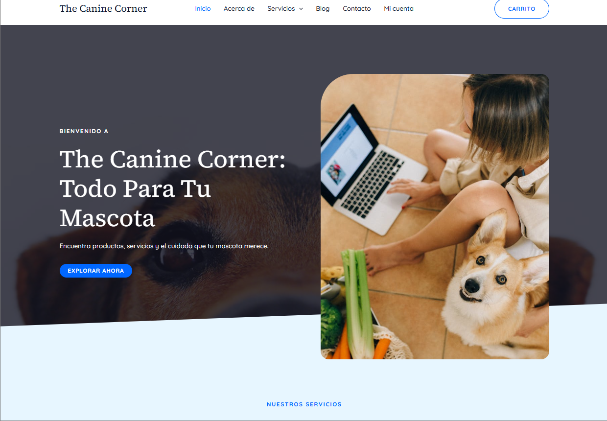

# Pets Shop Cloud

Proyecto eCommerce canino desarrollado como entorno de prueba y despliegue en AWS. Incluye:

- WordPress personalizado con carrito propio en PHP
- Infraestructura cloud con EC2, RDS y S3
- Scripts de automatización y migración
- Pruebas de carga y monitoreo básico
- Arquitectura con VPC y subredes seguras

Tecnologías: AWS, Linux, Apache, PHP, MySQL, Bash, 

## Capturas

## Requisitos para desplegar
- AWS CLI configurado
- EC2 Ubuntu 22.04 con Apache y PHP

- Instancia RDS MySQL configurada
